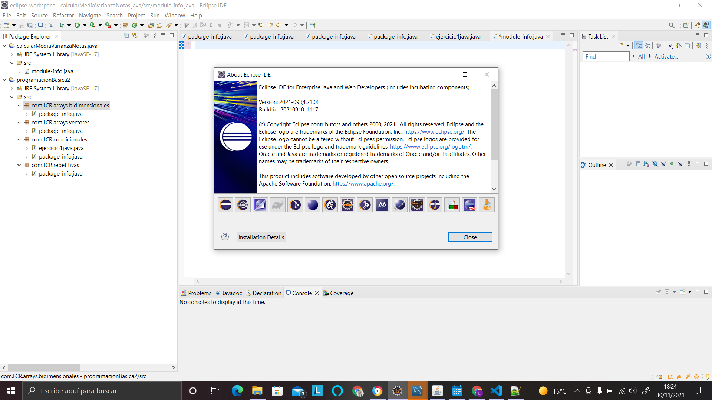
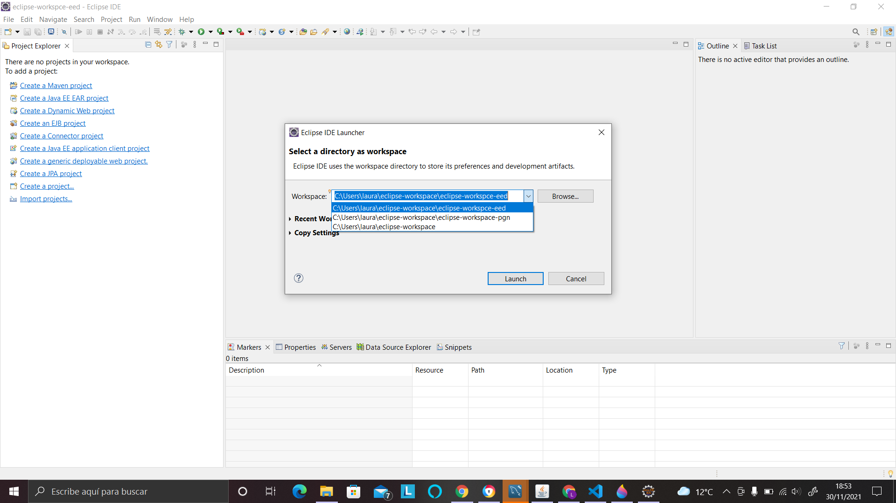
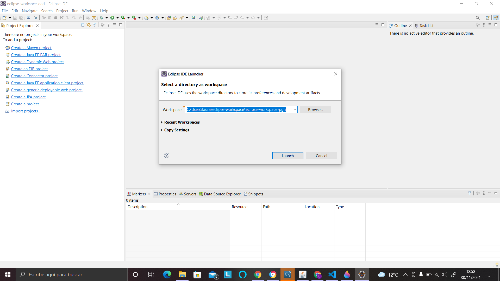
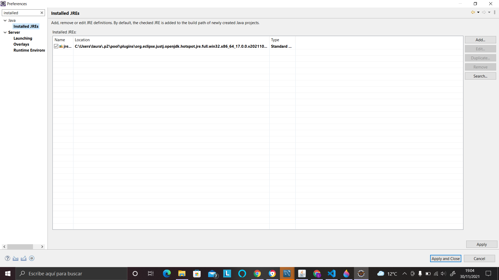
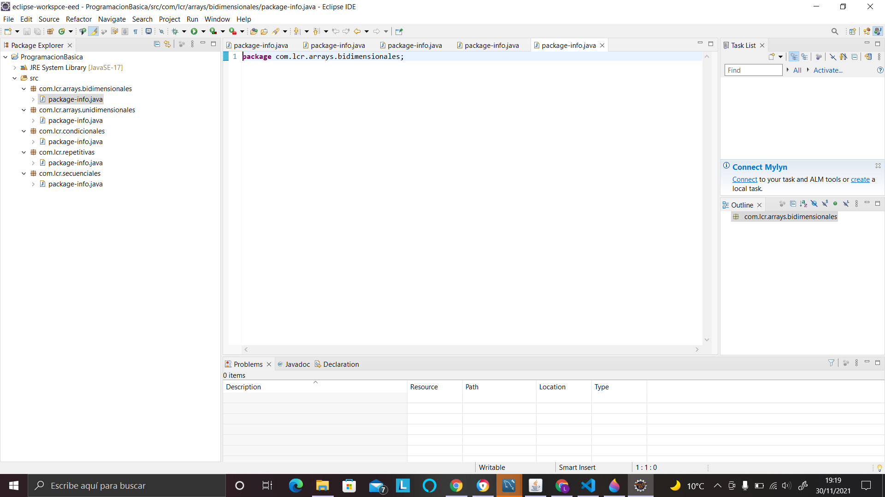
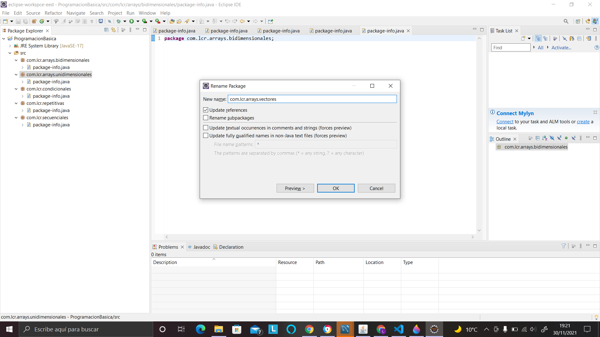
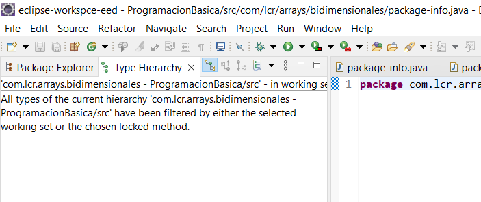
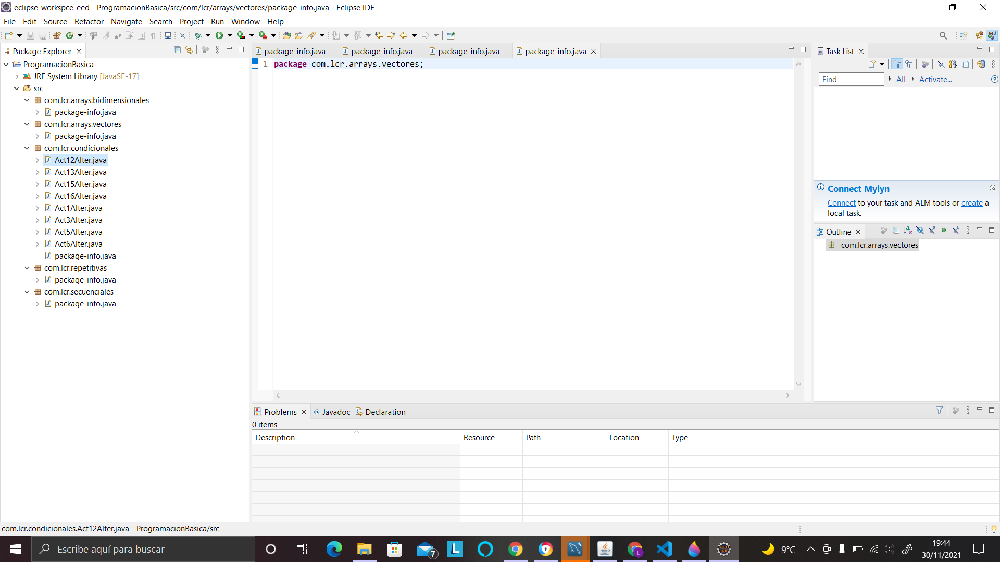
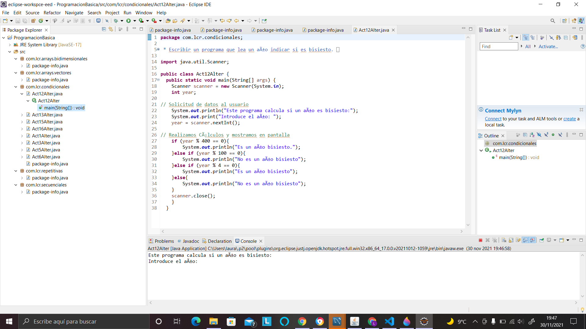
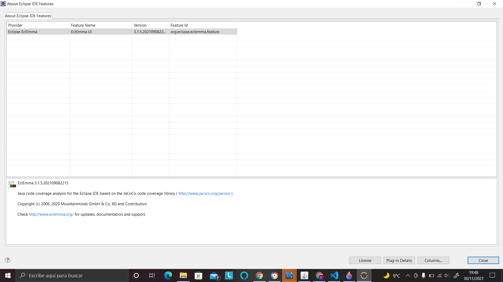

1. Ya tienes instalado el Eclipse "Eclipse IDE for Enterprise Java and Web Developers". Muestra la versión instalada en el About de Eclipse 

1. Crea un workspace para los trabajos de este módulo "Entornos de Desarrollo". Denomínalo "eclipse-workspace-eed". Podrás cambiarlo en Files>Switch Workspace>Others....

1. Crea un segundo workspace para el módulo "Programación". Denomínalo "eclipse-workspace-pgn".

1. Cambia de nuevo al  workspace de EED "eclipse-workspace-eed".

1. El instalador de Eclipse incluye el JRE 16. Añade JRE17. Para ello usa el Marketplace del propio Eclipse (Help>Eclipse Marketplace...). Confirma que aparece en Windows>preferences>Installed JREs

1. Crea un proyecto en Java sin módulos. Lo llamarás "ProgramacionBasica". Acabarás abriendo la perspectiva Java

1. Crea los siguientes paquetes. Así mantendrás las clases organizadas gracias a su funcionalidad. Cambia "mlmc" por tus siglas/nombre
    com.mlmc.secuenciales
    com.mlmc.repetitivas
    com.mlmc.condicionales
    com.mlmc.arrays.unidimensionales
    com.mlmc.arrays.bidimensionales
    
1. Cambia el nombre al paquete com.mlmc.arrays.unidimensionales por com.mlmc.arrays.vectores (F2)

1. Cambia la presentación del paquete: flat/hierarchical 

1. Importa a su paquete correspondiente los ficheros .java que has implementado en el módulo de programación. Asegúrate de copiar y no vincular. Puedes hacerlo:
    Desde el asistente File>Import
    Desde el menú contextual de la carpeta src>Import>General>File System
    Arrastrando los ficheros desde el sistema de ficheros a la carpeta src de Eclipse
    
1. Ejecuta un par de clases

1. Eclemma es una herramienta que usaremos en la fase de pruebas. Localiza la versión de Eclemma que tienes instalada en Eclipse. (Help>About)
